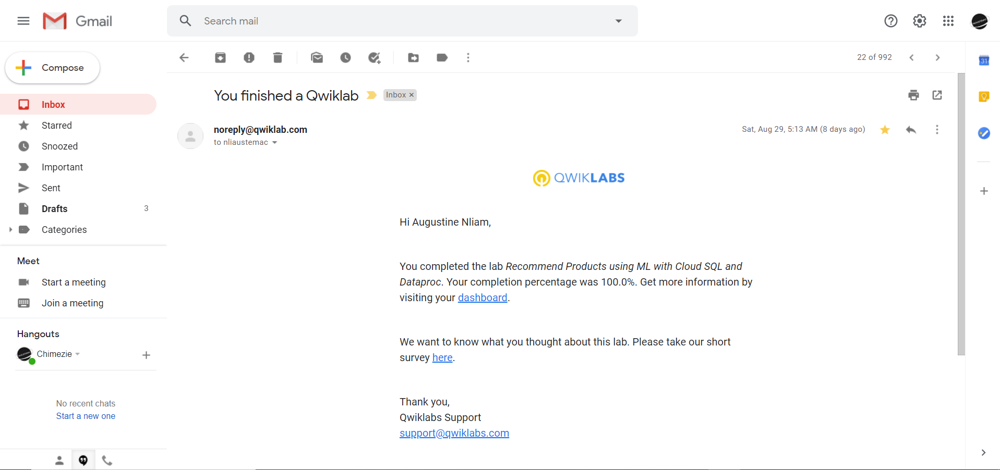
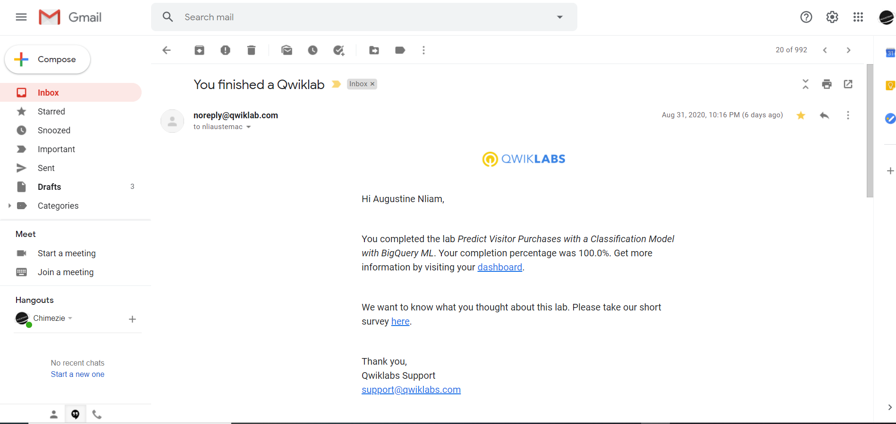

# Google Cloud Practice Project

##Labs
* ### Lab 1
    #### Title - Google Cloud Fundamentals: Getting Started with Cloud Marketplace 
    #### Objectives
     * To launch a cloud solution using Cloud Marketplace
    
    #### Task 1 - Use Market Place to deploy a LAMP stack
     ##### Steps (Code)
     *  `gcloud deployment-manager deployments create my-dep --config lampstack.jinja` 
       - The configuration for the 
            lampstack is defined in the lampstack,jinja file which is used by the deployment manager.
         
    #### Task 2 - Verify your deployment
     ##### Steps (Code)
     * Change the current working directory to opt/bitnami `cd /opt/bitnami`
     * Copy the phpinfo.php file to a publicly accessible directory under the web server document root `sudo sh -c 'echo "<?php phpinfo(); ?>" > apache2/htdocs/phpinfo.php'`
     * Visit the url to view the page `http://[SITE_ADDRESS]/phpinfo.php`
         
    #### Screenshots
    
* ### Lab 2
    #### Title - Google Cloud Fundamentals: Getting Started with Compute Engine
    #### Objectives
     * Create a Compute Engine virtual machine using the Google Cloud Platform (GCP) Console
     * Create a Compute Engine virtual machine using the gcloud command-line interface
     * Connect between the two instances
   #### Task 1 - Create a virtual machine using the GCP Console
    ##### Steps (Code)
    * Create a VM instance  `gcloud compute instances create my-vm-1 --zone=us-central1-a --machine-type=n1-standard-1 --subnet=default --network-tier=PREMIUM --maintenance-policy=MIGRATE --service-account=36480928317-compute@developer.gserviceaccount.com --scopes=https://www.googleapis.com/auth/devstorage.read_only,https://www.googleapis.com/auth/logging.write,https://www.googleapis.com/auth/monitoring.write,https://www.googleapis.com/auth/servicecontrol,https://www.googleapis.com/auth/service.management.readonly,https://www.googleapis.com/auth/trace.append --tags=http-server --image=debian-9-stretch-v20200910 --image-project=debian-cloud --boot-disk-size=10GB --boot-disk-type=pd-standard --boot-disk-device-name=my-vm-1 --reservation-affinity=any`
  #### Task 2 - Create a virtual machine using the gcloud command line
   ##### Steps (Code)
    * `gcloud compute instances create "my-vm-2" --machine-type "n1-standard-1" --image-project "debian-cloud" --image "debian-9-stretch-v20190213"--subnet "default"`
  #### Task 3 - Connect between VM instances
    ##### Steps (Code)
     * Connect to my-vm-2 via SSH and ping my-vm-1  `ping my-vm-1`
     * Connect to my-vm-1 instance - `ssh my-vm-1`
     * Install Nginx server `sudo apt-get install nginx-light -y`
     * Confirm the web server is running `curl http://localhost/`
  
  #### Screenshot
  
